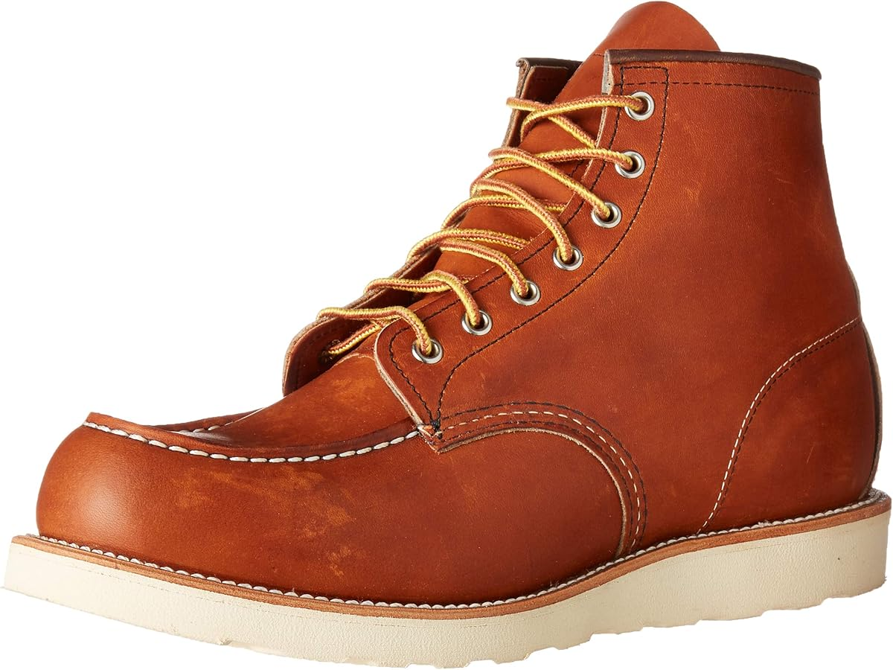

# Example: Red Wing Shoes 

In this example, I take the concept of the Matrix developed in [the Design](../design.qmd) and construct a fictious firm.
This demonstrates in practice how this design made be implemented with real firm data. 

For example, suppose we have a Minnesota firm such as [Red Wing Shoes](https://www.redwingshoes.com/). This firm mainly produces a variety of one type of commodity: Shoes similar to the one shown below. 



# Impacts

## Company Impact Matrix ($C$)

To implement the matrix, first we start with the Company Activity Matrix $(C)$. This specifies a list of activities in specific locations. To keep this simple, let us suppose the shoe manufacturer conducts only two production activities: factories to assemble shoes (assembly) and distribution of the manufactured product (distribution). Suppose that both assembly and distribution is measured by thousands of shoes. The following matrix describes activities $y$ in locations $x$.


```{r}
#| code-fold: true
#| warning: false
#| messages: false 

library(tibble)
library(knitr)
library(tidyverse)

# Simulate company activities for Red Wing Shoes
c <- tibble(
    city = c("Duluth", "Minneapolis", "St Paul", "Rochester", "Mankato"),
    assembly = c(100, 50, 0, 0, 10), 
    distribution = c(10, 40, 60, 25, 25)
)

# Print Company Activity Matrix
kable(c)
```


## Single Impact Matrix ($I_z$)

The impact of Red Wings can be viewed through the three following categories: 

**Impact Categories:**

| Category | Scope | Description |
|----------|-------|-------------|
| Category 1 | Direct Operations | Dependencies and impacts from the company's own operations only |
| Category 2 | Supply Chain | Category 1 plus dependencies and impacts from upstream suppliers back to primary producers |
| Category 3 | Full Value Chain | Category 2 plus dependencies and impacts from downstream activities through to final end consumers |

For this example, let us consider only three potential impacts ($z$). These are: 

1. Water Pollution (Category 1): Water pollution from the tanning and dyeing processes in assembly activities.
2. Carbon Emissions (Category 1): GHG emissions related to distribution of shoes from the distribution centers. 
3. Carbon Emissions (Category 2): GHG emissions from the animal hides necessary to produce the leather for shoe production. 

For each of these three impacts, we then construct a single impact matrix $(I_z)$. This means for the Company Activities Matrix $(C)$ we translate the activities $y$ in locaiton $x$ into impacts $z | y,x$.

### Water Pollution (Category 1)

This relates to assembly plants only. We will measure pollution as g/ha of total dissolved solids (TDS).

```{r}
#| code-fold: true
#| warning: false
#| messages: false 

# Simulate company activities for Red Wing Shoes
z1 <- tibble(
    city = c("Duluth", "Minneapolis", "St Paul", "Rochester", "Mankato"),
    assembly = c(10, 5, 0, 0, 1)
)

# Print Impact Matrix
kable(z1)
```

### Carbon Emissions (Category 1)

This relates to distribution centers only. We will measure GHG as tons of $CO_2e$.

```{r}
#| code-fold: true
#| warning: false
#| messages: false 

# Simulate company activities for Red Wing Shoes
z2 <- tibble(
    city = c("Duluth", "Minneapolis", "St Paul", "Rochester", "Mankato"),
    distribution = c(1, 4, 6, 2.5, 2.5)
)

# Print Impact Matrix
kable(z2)
```

### Carbon Emissions (Category 2)

This relates to assembly plants only.  We will measure GHG as tons of $CO_2e$.

```{r}
#| code-fold: true
#| warning: false
#| messages: false 

# Simulate company activities for Red Wing Shoes
z3 <- tibble(
    city = c("Duluth", "Minneapolis", "St Paul", "Rochester", "Mankato"),
    assembly = c(5, 2, 0, 0, 0.5)
)

# Print Impact Matrix
kable(z3)
```

## Company Single Impact Matrix ($CI_z$)

Not clear on this...


## Company Location Single Impact Vector ($LCI_z$)

We can summarize the impact of *all* activites $y$ in a locaiton $x$ for any given impact $z$. In our example, this produces two vectors of location level impacts for water pollution and GHG emissions. Note, that this only impacts GHG emissions as they are covered via two seperate activities $y$ (distribution and assembly) through two seperate impact scopes (Scope 1 and 2, respectively). 

### Water Pollution

```{r}
#| code-fold: true
#| warning: false
#| messages: false 

# Repeat z1
cz1 <- z1 |> 
    rename(water = assembly)

# Print Company Impact
kable(cz1)
```

### Carbon Emissions

```{r}
#| code-fold: true
#| warning: false
#| messages: false 


# Summarize z2 and z3 across cities 
cz2 <- left_join(z2, z3, by = "city") |>
    mutate(ghg = distribution + assembly) |>
    select(-c(distribution, assembly))

# Print Company Impact
kable(cz2)
```

## Company Impact Matrix ($CI$)

We can determine the overall impact at each location $x$ across all environmental concerns $z$ by combining the individual impact vectors ($LCI_z$)

```{r}
#| code-fold: true
#| warning: false
#| messages: false 

# Combine water and ghg emissions
ci <- left_join(cz1, cz2, by = "city")

# Print Company Impact
kable(ci)
```


## Financial Impact Matrix ($FI$)

With $CI$ we have the location $x$ level aggregation of all impacts $z$ in environmental terms. To translate this into monetary terms, we need to use either a non-market valuation method or avoided abatement cost to translate these emissions into financial terms. For our example, we want to know the willingness-to-pay (WTP) to reduce TDS of water pollution and the social cost of carbon (SCC) as measured through carbon rental rates. 

### Water Pollution

For water pollution, suppose that we have a homogenous WTP for reducing a g/ha of total dissolved solids (TDS). You can imagine that this translates to heterogenous prices spatially across locations if there is important variation. Or this could be modified if the activity for the source of the impact has different abatement costs (e.g., it is cheaper or more expensive to abatement emissions at different stages of the production process). 

For our example, suppose: 

$$
WTP_{TDS} = \$500 \text{ g/ha}
$$

We can simply multiply this rate by the emissions rate from the Company Location Single Impact Vector ($LCI_z$).

```{r}
#| code-fold: true
#| warning: false
#| messages: false 

# WTP 
wtp <- 500

# Convert by WTP
fi1 <- cz1 |> 
    mutate(water = water * wtp)

# Print Financial Impact
kable(fi1)
```

### Carbon Emissions

For our example, suppose: 

$$
WTP_{GHG} = \$190 \text{ tons } CO_2e
$$

We can simply multiply this rate by the emissions rate from the Company Location Single Impact Vector ($LCI_z$).

```{r}
#| code-fold: true
#| warning: false
#| messages: false 

# WTP 
wtp <- 190

# Convert by WTP
fi2 <- cz2 |> 
    mutate(ghg = ghg * wtp)

# Print Financial Impact
kable(fi2)
```

## Company Financial Impact Matrix ($CFI$)

This is a trival aggregation of the monetary impact values the same analogous to the Company Impact Matrix ($CI$).

```{r}
#| code-fold: true
#| warning: false
#| messages: false 

# Combine water and ghg emissions
fi <- left_join(fi1, fi2, by = "city")

# Print Company Impact
kable(fi)
```

# Dependencies

Again, we repeat this procedure for all the ecosysetm services that the firm is dependent on from nature. 
To keep this simple, let us suppose that again, we only have three dependencies: 

1. Water Supply (Scope 1): Water supply used in the assembly of the shoes.
2. Energy Resources (Scope 1): Energy used in *both* the assembly and distribution process. 
3. Livestock Production (Scope 2): The reliance on biomass for livestock production which provides the leather for shoe production.

## Single Dependency Matrix ($D_z$)

### Water Supply (Scope 1)

This relates to assembly plants only. We will measure water supply in $m^3$.

```{r}
#| code-fold: true
#| warning: false
#| messages: false 

# Simulate company dependencies for Red Wing Shoes
d1 <- tibble(
    city = c("Duluth", "Minneapolis", "St Paul", "Rochester", "Mankato"),
    assembly = c(8, 4, 0, 0, 0.8)
)

# Print Dependency Matrix
kable(d1)
```

### Energy Resources (Scope 1)

This relates to both assembly plants and distribution centers. We will measure energy in MWh.

```{r}
#| code-fold: true
#| warning: false
#| messages: false 

# Simulate company dependencies for Red Wing Shoes
d2 <- tibble(
    city = c("Duluth", "Minneapolis", "St Paul", "Rochester", "Mankato"),
    assembly = c(20, 10, 0, 0, 2),
    distribution = c(5, 20, 30, 12.5, 12.5)
)

# Print Dependency Matrix
kable(d2)
```

### Livestock Production (Scope 2)

This relates to assembly plants only. We will measure biomass dependence in tons.

```{r}
#| code-fold: true
#| warning: false
#| messages: false 

# Simulate company dependencies for Red Wing Shoes
d3 <- tibble(
    city = c("Duluth", "Minneapolis", "St Paul", "Rochester", "Mankato"),
    assembly = c(3, 1.2, 0, 0, 0.3)
)

# Print Dependency Matrix
kable(d3)
```


## Company Single Dependency Matrix ($CD_z$)

Not clear on this...


## Company Location Single Dependency Vector ($LCD_z$)

### Water Supply

```{r}
#| code-fold: true
#| warning: false
#| messages: false 

# Repeat d1
cd1 <- d1 |> 
    rename(water_supply = assembly)

# Print Company Dependency
kable(cd1)
```

### Energy Resources

```{r}
#| code-fold: true
#| warning: false
#| messages: false 

# Summarize energy dependencies across cities
cd2 <- d2 |>
    mutate(energy = assembly + distribution) |>
    select(-c(assembly, distribution))

# Print Company Dependency
kable(cd2)
```

### Livestock Production

```{r}
#| code-fold: true
#| warning: false
#| messages: false 

# Repeat d3
cd3 <- d3 |> 
    rename(livestock = assembly)

# Print Company Dependency
kable(cd3)
```

## Company Dependency Matrix ($CD$)

```{r}
#| code-fold: true
#| warning: false
#| messages: false 

# Combine water, energy, and livestock dependencies
cd <- cd1 |>
    left_join(cd2, by = "city") |>
    left_join(cd3, by = "city")

# Print Company Dependency
kable(cd)
```

## Financial Dependence Matrix ($FD$)

### Water Supply

```{r}
#| code-fold: true
#| warning: false
#| messages: false 

# Unit value
wtp <- 40

# Convert by unit value
fd1 <- cd1 |>
    mutate(water_supply = water_supply * wtp)

# Print Financial Dependence
kable(fd1)
```

### Energy Resources

```{r}
#| code-fold: true
#| warning: false
#| messages: false 

# Unit value
wtp <- 120

# Convert by unit value
fd2 <- cd2 |>
    mutate(energy = energy * wtp)

# Print Financial Dependence
kable(fd2)
```

### Livestock Production

```{r}
#| code-fold: true
#| warning: false
#| messages: false 

# Unit value
wtp <- 250

# Convert by unit value
fd3 <- cd3 |>
    mutate(livestock = livestock * wtp)

# Print Financial Dependence
kable(fd3)
```


## Company Financial Dependence Matrix ($CFD$)

```{r}
#| code-fold: true
#| warning: false
#| messages: false 

# Combine water, energy, and livestock dependence values
cfd <- fd1 |>
    left_join(fd2, by = "city") |>
    left_join(fd3, by = "city")

# Print Company Financial Dependence
kable(cfd)
```

