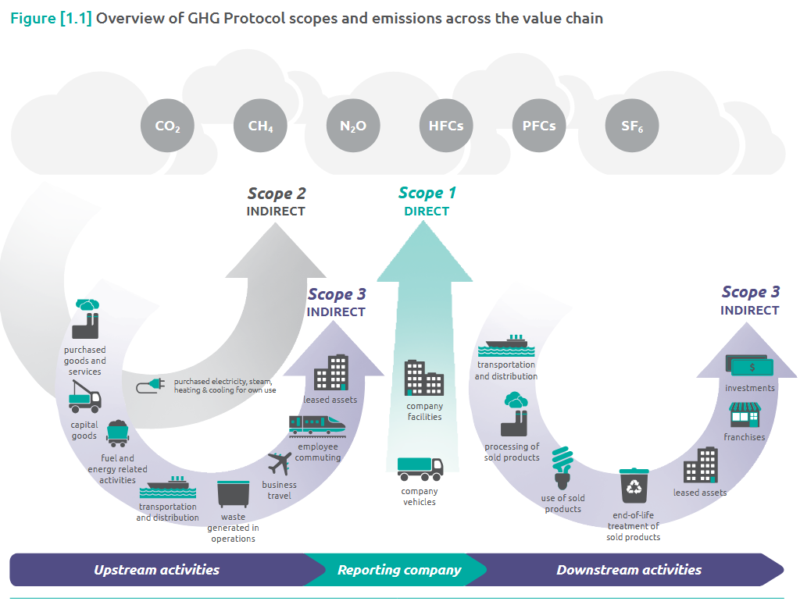

We can categorize the environmental impact of economic production through the emissions produced as a by-product of production. 
We can conceptualize emissions emiting from the corporate value chain using the three scope approach of the [Greenhouse Gas Protocol](https://ghgprotocol.org/sites/default/files/standards/Corporate-Value-Chain-Accounting-Reporing-Standard_041613_2.pdf). These three scopes are: 

1. **Scope 1:** Direct emissions from owned or controlled sources
2. **Scope 2:** Indirect emissions from purchased energy (electricity, heating, coooling, steam)
3. **Scope 3:** Indirect emissions from value chain (upstream & downstream)

In this manner, we are able to categorize a variety of emissions and negative externalities from economic production into either these three scopes considering and if the emission comes from upstream activities, company activites, or downstream activities.

# Air Pollutants 

For air pollutants, we can approximate changes in air quality through real-time air quality indices such as [IQAir](https://www.iqair.com/us/world-air-quality). Alternatively, we could attempt to measure each contributor seperately to asessing direct channels of emissions through changes in production. 

## Carbon Dioxide ($CO_2$) (EM 1.1)

**Defintion:**

**Impact on Environment:**

**Optimal Natural Levels:**

**Related Economic Activites:**
- Specific to NAICS codes

## Black Carbon (BC) (EM 1.2)

**Defintion:**

**Impact on Environment:**

**Optimal Natural Levels:**

**Related Economic Activites:**
- Specific to NAICS codes

## Methane ($CH_4$) (EM 1.3)

**Defintion:**

**Impact on Environment:**

**Optimal Natural Levels:**

**Related Economic Activites:**
- Specific to NAICS codes

## Nitrous Oxide ($N_2O$) (EM 1.4)

**Defintion:**

**Impact on Environment:**

**Optimal Natural Levels:**

**Related Economic Activites:**
- Specific to NAICS codes

## Fluorinated Gases (EM 1.5)

Hydrofluorocarbons, perfluorocarbons, sulfur hexafluoride, and nitrogen trifluorid

**Defintion:**

**Impact on Environment:**

**Optimal Natural Levels:**

**Related Economic Activites:**
- Specific to NAICS codes

## Ozone-Depleting Substances (EM 1.6)

Ozone $O_3$
chlorofluorocarbons, hydrochlorofluorocarbons, and halons

**Defintion:**

**Impact on Environment:**

**Optimal Natural Levels:**

**Related Economic Activites:**
- Specific to NAICS codes

## Particulate Matter (PM) (EM 1.7)

Coarse PM10 
Fine PM2.5

**Defintion:**

**Impact on Environment:**

**Optimal Natural Levels:**

**Related Economic Activites:**
- Specific to NAICS codes

## Sulfur Dioxide ($SO_2$) (EM 1.8)

**Defintion:**

**Impact on Environment:**

**Optimal Natural Levels:**

**Related Economic Activites:**
- Specific to NAICS codes

## Carbon Monoxide ($CO$) (EM 1.9)

**Defintion:**

**Impact on Environment:**

**Optimal Natural Levels:**

**Related Economic Activites:**
- Specific to NAICS codes

## Non-methane Volatile Organic Compounds (VOCS) (EM 1.10)

**Defintion:**

**Impact on Environment:**

**Optimal Natural Levels:**

**Related Economic Activites:**
- Specific to NAICS codes

## Ammonia ($NH_3$) (EM 1.11)

**Defintion:**

**Impact on Environment:**

**Optimal Natural Levels:**

**Related Economic Activites:**
- Specific to NAICS codes

# Water Pollutants 

Again for water pollution, we could use a composite measure such as Water Quality Index (WQI). [GEMStat](https://gemstat.org/data-gemstat/data-portal/) provides a cross-sectional database of WQI globally. 

## Suspended Solids 

### Primary Sludge  (EM 2.1)

**Defintion:**

**Impact on Environment:**

**Optimal Natural Levels:**

**Related Economic Activites:**
- Specific to NAICS codes

### Secondary Sludge (EM 2.2)

**Defintion:**

**Impact on Environment:**

**Optimal Natural Levels:**

**Related Economic Activites:**
- Specific to NAICS codes

### Chemical Sludge (EM 2.3)

**Defintion:**

**Impact on Environment:**

**Optimal Natural Levels:**

**Related Economic Activites:**
- Specific to NAICS codes

### Mineral Sludge (EM 2.4)

**Defintion:**

**Impact on Environment:**

**Optimal Natural Levels:**

**Related Economic Activites:**
- Specific to NAICS codes

### Waste Activated Sludge (EM 2.5) 

**Defintion:**

**Impact on Environment:**

**Optimal Natural Levels:**

**Related Economic Activites:**
- Specific to NAICS codes

## Biodegradable Organic Matter 

### Dissolved Oxygen (DO) (EM 2.6)

**Defintion:**

**Impact on Environment:**

**Optimal Natural Levels:**

**Related Economic Activites:**
- Specific to NAICS codes

### Biochemical Oxygen Demand (BOD) (EM 2.7)

**Defintion:**

**Impact on Environment:**

**Optimal Natural Levels:**

**Related Economic Activites:**
- Specific to NAICS codes

## Chemical Oxygen Demand (COD) (EM 2.8)

**Defintion:**

**Impact on Environment:**

**Optimal Natural Levels:**

**Related Economic Activites:**
- Specific to NAICS codes

## Non-biodegradable Organic Matter 

### Pesticides (EM 2.9)

Organochlorines 

Organophosphates

Neonicotinoids

**Defintion:**

**Impact on Environment:**

**Optimal Natural Levels:**

**Related Economic Activites:**
- Specific to NAICS codes

### Detergents (EM 2.10)

Chromium-6, Arsenic, Nitrates

Linear alkylbenzene sulfonates (LAS)

Alcohol ether sulfates (AES)

**Defintion:**

**Impact on Environment:**

**Optimal Natural Levels:**

**Related Economic Activites:**
- Specific to NAICS codes

## Inorganic Dissolved solids 

### Total dissolved solids (TDS) (EM 2.11)

**Defintion:**

**Impact on Environment:**

**Optimal Natural Levels:**

**Related Economic Activites:**
- Specific to NAICS codes

### Salinity (Na) (EM 2.12)

Sodium Chloride

**Defintion:**

**Impact on Environment:**

**Optimal Natural Levels:**

**Related Economic Activites:**
- Specific to NAICS codes

### Arsenic (EM 2.13)

Industrial smelting, pesticides

**Defintion:**

**Impact on Environment:**

**Optimal Natural Levels:**

**Related Economic Activites:**
- Specific to NAICS codes

### Cyanide (Plastics) (EM 2.14) 

Plastics

**Defintion:**

**Impact on Environment:**

**Optimal Natural Levels:**

**Related Economic Activites:**
- Specific to NAICS codes

#### Microplastics 

### Lead (EM 2.15)

Mining, plumbing, gasoline, coal

**Defintion:**

**Impact on Environment:**

**Optimal Natural Levels:**

**Related Economic Activites:**
- Specific to NAICS codes

### Mercury (EM 2.16)

Mining, combustion, industrial waste

**Defintion:**

**Impact on Environment:**

**Optimal Natural Levels:**

**Related Economic Activites:**
- Specific to NAICS codes

### Thallium (EM 2.17)

Glass, pharmaceuticals, electronics

**Defintion:**

**Impact on Environment:**

**Optimal Natural Levels:**

**Related Economic Activites:**
- Specific to NAICS codes

## Pathogens 

### Escherichia Coli (E. Coli) (EM 2.18)

**Defintion:**

**Impact on Environment:**

**Optimal Natural Levels:**

**Related Economic Activites:**
- Specific to NAICS codes

### Parasitic Worms (EM 2.19)

Eggs from helminths (large macro parasites)
Parasticially steals nutrients from the host
Most common:
- Ascaris
- Hookworm
- Whipworm

**Defintion:**

**Impact on Environment:**

**Optimal Natural Levels:**

**Related Economic Activites:**
- Specific to NAICS codes

## Nitrogen Runoff (EM 2.20)

**Defintion:**

**Impact on Environment:**

**Optimal Natural Levels:**

**Related Economic Activites:**
- Specific to NAICS codes

## Phosphorus Runoff (EM 2.21)

**Defintion:**

**Impact on Environment:**

**Optimal Natural Levels:**

**Related Economic Activites:**
- Specific to NAICS codes

# Soil Pollutants (Contaminants)

Xenobiotic chemicals or other alterations to natural soil environments

The most common chemicals involved are petroleum hydrocarbons,[4] polynuclear aromatic hydrocarbons (such as naphthalene and benzo(a)pyrene),[5] solvents,[6] pesticides,[7] and heavy metals.

## Petroleum Hydrocarbons (EM 3.1)

**Definition:**

**Impact on Environment:**

**Optimal Natural Levels:**

**Related Economic Activities:**
- Specific to NAICS codes

## Polynuclear Aromatic Hydrocarbons (PAHs) (EM 3.2)

**Definition:**

**Impact on Environment:**

**Optimal Natural Levels:**

**Related Economic Activities:**
- Specific to NAICS codes

## Heavy Metals

### Lead (EM 3.3)

**Definition:**

**Impact on Environment:**

**Optimal Natural Levels:**

**Related Economic Activities:**
- Specific to NAICS codes

### Mercury (EM 3.4)

**Definition:**

**Impact on Environment:**

**Optimal Natural Levels:**

**Related Economic Activities:**
- Specific to NAICS codes

### Cadmium (EM 3.5)

**Definition:**

**Impact on Environment:**

**Optimal Natural Levels:**

**Related Economic Activities:**
- Specific to NAICS codes

## Solid Municipal Waste (EM 3.6)

**Definition:**

**Impact on Environment:**

**Optimal Natural Levels:**

**Related Economic Activities:**
- Specific to NAICS codes

## Plastic Waste (EM 3.7)

**Definition:**

**Impact on Environment:**

**Optimal Natural Levels:**

**Related Economic Activities:**
- Specific to NAICS codes

## Electronic Waste (E-Waste) (EM 3.8)

**Definition:**

**Impact on Environment:**

**Optimal Natural Levels:**

**Related Economic Activities:**
- Specific to NAICS codes

## Perfluoroalkyl and Polyfluoroalkyl Substances (PFAS) (EM 3.9)

**Definition:**

**Impact on Environment:**

**Optimal Natural Levels:**

**Related Economic Activities:**
- Specific to NAICS codes

## Pharamecutical Waste (EM 3.10)

**Definition:**

**Impact on Environment:**

**Optimal Natural Levels:**

**Related Economic Activities:**
- Specific to NAICS codes

